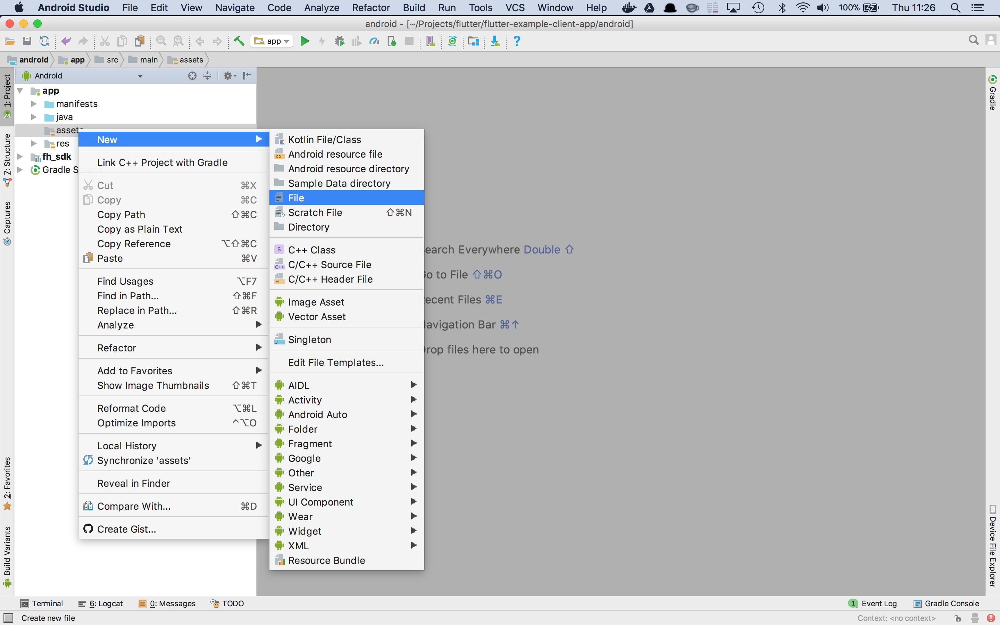

# QuickStart Flutter Client-side Template
---------
Author: Carlos Vicens   
Level: Intermediate   
Technologies: Dart, Flutter, RHMAP   
Summary: A basic Flutter client side template with RHMAP.   
Target Product: RHMAP   
Product Versions: Dart 2.0.0-dev.28.0.flutter-0b4f01f759, Flutter 0.1.5   
Source: https://github.com/cvicens/flutter-example-client-app


**Prerequisites:**

- Red Hat Mobile environmet to deploy a sample Cloud App
- CocoaPods (only for iOS) 1.4.0+
- iOS 10, 11 [SDK supported configuration](https://access.redhat.com/node/2357761)
- Android Oreo API 26
- flutter: 0.1.5
- fh_sdk : 0.6.2+ [documentation](https://www.npmjs.com/package/rct-fh)


# Introduction
Almost one year ago now, in May 2017, Google presented the first release of [Flutter](https://flutter.io) a [revolutionary](https://hackernoon.com/whats-revolutionary-about-flutter-946915b09514) mobile UI framework to build multi-platform mobile applications. In this article I'm going to explain how to integrate a Flutter App with Red Hat Mobile.

In order to integrate a Flutter App with Red Hat Mobile we need a [Flutter plugin](https://flutter.io/developing-packages/#plugin) that provides a Flutter interface to both Android and iOS Red Hat Mobile SDKs. I have developed such a plugin, you can it find [here](https://pub.dartlang.org/packages/fh_sdk).

This article is the first of three parts, I'll cover the following operations:

* $fh.init()
* $fh.cloud()

The second part will be devoted to $fh.auth() and the final piece to push notifications.

**Note:** This article doesn't represent a state of direction or roadmap for Red Hat Mobile or any other product. As of the time of writing Flutter is Beta and the aim of the article is just to show how easy it is to integrate Flutter with Red Hat Mobile although this integration is not official and hence not supported. 

## TL;DR
I'm going to show how to create a mobile app which will invoke a simple service running on Red Hat Mobile with Flutter and deploy it to iOS and Android. If you're still interested stick around.

### What's Flutter?
In short, [Flutter](https://flutter.io) it's a mobile UI framework based on [Dart](https://www.dartlang.org/) with which you can build mobile apps in Dart and deploy then on iOS, Android and even Fuchsia.

### What's Dart?
Dart It's a programming language with some interesting singularities which make it perfect for mobile development, I'll just point to one of them, for a more through explanation go to [Why Flutter uses Dart?](https://hackernoon.com/why-flutter-uses-dart-dd635a054ebf)
Dart can be compiled AOT (Ahead Of Time), like C for instance, to create fast, predictable, native code... and also be JIT (Just In Time), compiled, like Javascript for exceptionally fast development cycles (including hot reload).

### What's Red Hat Mobile
[Red Hat Mobile](https://access.redhat.com/products/red-hat-mobile-application-platform/) It's a platform that speeds up the development, integration, deployment, and management of mobile apps for businesses. Red Hat Mobile runs on top of [Openshift](https://access.redhat.com/products/red-hat-openshift-container-platform/) enhancing it with core mobile services.

# Implementation
We're going to create an app from the scratch but first of all you need to meet some requirements:

* iOS and/or Android development tools need to be installed. In my case XCode 9.2 and Android Studio 3.0.1
* Cocoa Pods (only for iOS), I'm using Cocoa Pods 1.4.0
* Flutter, in my case it's Flutter 0.1.5

## Getting started with Flutter
For a nice step by step guide to get you started with Flutter go [here](https://flutter.io/get-started/), the very first step will help you to install Flutter.

## Let's Create a flutter app
So we have mobile SDKs and Flutter in place and we can create our RH Mobile enabled Flutter App.
Before we actually create the App just check flutter bin is correctly installed and reachable according to your PATH environment variable.

```
$ flutter --version
Flutter 0.1.5 • channel beta • https://github.com/flutter/flutter.git
Framework • revision 3ea4d06340 (8 weeks ago) • 2018-02-22 11:12:39 -0800
Engine • revision ead227f118
Tools • Dart 2.0.0-dev.28.0.flutter-0b4f01f759
```

Let's check if flutter can 'see' a connected device. To demonstrate this I'm going to start the Android and iOS emulators. 

List Android AVDs (Android Virtual Devices)

```
 $ ~/Library/Android/sdk/tools/bin/avdmanager list avd
 Available Android Virtual Devices:
     Name: Nexus_5_API_25
  Device: Nexus 5 (Google)
    Path: /Users/cvicensa/.android/avd/Nexus_5_API_25.avd
  Target: Google APIs (Google Inc.)
          Based on: Android 7.1.1 (Nougat) Tag/ABI: google_apis/x86_64
    Skin: nexus_5
  Sdcard: /Users/cvicensa/.android/avd/Nexus_5_API_25.avd/sdcard.img
---------
    Name: Nexus_5X_API_26
  Device: Nexus 5X (Google)
    Path: /Users/cvicensa/.android/avd/Nexus_5X_API_26.avd
  Target: Google APIs (Google Inc.)
          Based on: Android API 26 Tag/ABI: google_apis/x86
    Skin: nexus_5x
  Sdcard: 100M
```

Start your preferered AVD.

```
$ cd ~/Library/Android/sdk/tools/
$ ./emulator -avd Nexus_5X_API_26
```

Now list devices available for Flutter.

```
$ flutter devices
1 connected devices:

Android SDK built for x86 • emulator-5554                            • android-x86 • Android 8.0.0 (API 26) (emulator)

```

Now let's do the same with the iOS simulator.

```
$ open -a Simulator.app
```

And list again the available devices.

```
$ flutter devices
2 connected devices:

Android SDK built for x86 • emulator-5554                        • android-x86 • Android 8.0.0 (API 26) (emulator)
iPhone X                  • 2E729265-625D-488A-B41B-BAFEB523F2B4 • ios         • iOS 11.2 (simulator)

```


Now we're ready to create the app **flutter_example_client_app** and run it both in iOS and Android. Remember to substitute the `--org com.redhat` with your own.

```
$ flutter create --org com.redhat flutter_example_client_app
Creating project flutter_example_client_app...
  flutter_example_client_app/ios/Runner.xcworkspace/
  ...
  flutter_example_client_app/.idea/workspace.xml (created)
Wrote 66 files.

Running "flutter packages get" in flutter_example_client_app...  8.4s

[✓] Flutter is fully installed. (Channel beta, v0.1.5, on Mac OS X 10.13.3 17D47, locale en-GB)
[✓] Android toolchain - develop for Android devices is fully installed. (Android SDK 26.0.2)
[!] iOS toolchain - develop for iOS devices is partially installed; more components are available. (Xcode 9.2)
[✓] Android Studio is fully installed. (version 3.0)
[✓] VS Code is fully installed. (version 1.21.1)
[✓] Connected devices is fully installed. (2 available)

Run "flutter doctor" for information about installing additional components.

All done! In order to run your application, type:

  $ cd flutter_example_client_app
  $ flutter run

Your main program file is lib/main.dart in the flutter_example_client_app directory.
```

Before we add the plugin for Red Hat mobile let's check everything works.

To run an app in a specific device use `-d <device>`, to run it in all your devices use `-d all`. I'm goint to run it in the iOS Simulator. Tap the floating button, you'll see the counter state change.

```
$ cd flutter_example_client_app
$ flutter run -d 2E727775-625D-488A-B41B-BAF77523F2B4
Launching lib/main.dart on iPhone X in debug mode...
Syncing files to device iPhone X...                   1.1s

🔥  To hot reload your app on the fly, press "r". To restart the app entirely, press "R".
An Observatory debugger and profiler on iPhone X is available at: http://127.0.0.1:8104/
For a more detailed help message, press "h". To quit, press "q".

```

This should be the result.


Now if you make any changes to ./lib/main.dart ant hit 'r' you should see changes happening under 1 second in the simulator.

Open ./lib/main.dart and make the following change.

'Flutter Demo Home Page => 'Red Hat + Flutter Demo'
``` dart
	home: new MyHomePage(title: 'Flutter Demo Home Page'),
```

Save changes, go the the terminal where we left flutter running and hit 'r'.

```
🔥  To hot reload your app on the fly, press "r". To restart the app entirely, press "R".
An Observatory debugger and profiler on iPhone X is available at: http://127.0.0.1:8104/
For a more detailed help message, press "h". To quit, press "q".

Initializing hot reload...                                
Reloaded 1 of 482 libraries in 585ms.
```

Let's have a look to the Simulator and see what we got after 585ms.


Before going on with the implementation of our example app let's have a closer look to the relevant folders and files for this exercise.

* **pubspec.yaml** this file contains dependencies and configuration statements
* **lib/** this folder contains at least main.dart as the entry point to our app
* **android/** android project folder
* **ios/** iOS project/workspace folder


## Adding Feedhenry SDK

Open **pubspec.yaml** and add fh_sdk package, this package provides our app with the iOS and Android SDK to access services running on Red Hat Mobile.

``` yaml
dependencies:
  flutter:
    sdk: flutter

  cupertino_icons: ^0.1.0

  # Feedhenry SDK
  fh_sdk: ^0.6.2

```

Let's set the iOS platform in file `./ios/Podfile` to 9.0. As in the following excerpt.

```
# Uncomment this line to define a global platform for your project
platform :ios, '9.0'
```

In order to update the package dependencies and instanciate them we need to restart the app. Go to the terminal window where flutter is running and hit 'q' then run it again with flutter `run -d device-id`

## Create an empty project in RH Mobile
Log in your RHMAP environment and create a new project by clicking on **Projects→New Project** and selecting 'Hello World Project' template.
Give your Project and Cloud App a name, unselect the Cordova App. 


Additionally select iOS and Android client Apps and give them a name.


You may wonder why do we need to create an iOS and an Android by selecting the native templates for those platforms. Well it's just a little hack to generate the connection definition in Red Hat Mobile and obtain the corresponding configuration files (fhconfig.plist and fhconfig.properties).

Now it's time to get those files and save them, we'll need them in a minute!

## Adding our configuration file to the iOS workspace

Open `./ios/Runner.xcworkspace/` with XCode. Right click the project on the project browser and click on New File.

Select Property List type of file and give the name 'fhconfig.plist'.

Finally edit the content and paste the configuration you saved before.

Now the iOS project is set up to invoke services exposed in our Cloud App.

## Adding our configuration file to the Android project

Prior to create the 'asset' folder we have to import the android project into Android Studio. To do so, select the menu item **File→New→Import Project** and browse to find the './android/' folder inside your application folder and select it.


After importing the project you should be able to see the app folder along with another folder devoted to the Red Hat Mobile SDK.


Now it's time to create the 'asset' folder where we'll put our configuration file. To create this folder right click on the 'app' item in the project browser and select the menu item **New→Folder→Asset Folder**  as in the next picture.


On the next screen leave the defaults and click on Finish.


Now let's right click on the assets folder and select the menu item **New→File** and name the file as 'fhconfig.properties'.




Finally copy the contents of the file we saved previously. As in the following picture.


## Time to use [fh_sdk](https://pub.dartlang.org/packages/fh_sdk) plugin
As we have added **fh_sdk** dependency in **pubspec.yaml** we can import the package as follows.

``` dart
import 'package:fh_sdk/fh_sdk.dart';
```

Then we have access to the FH class and we can use it to invoke operations as in the following example of an 'init()' call.

``` dart

```

## Stop the flutter app in your devices 

'q' 

## Start again the app...

